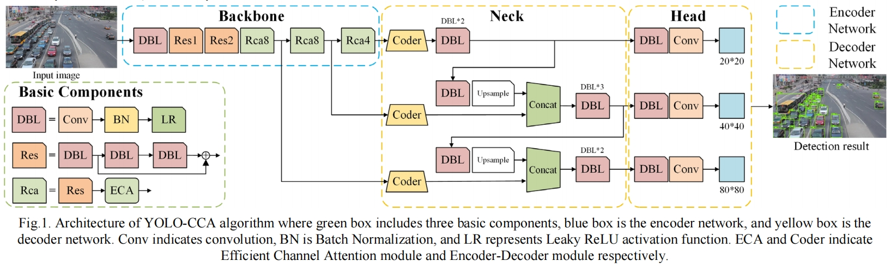
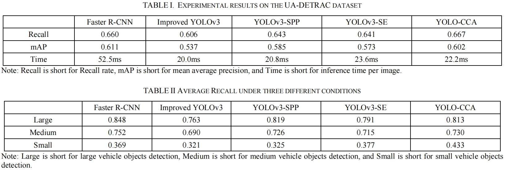

# YOLO-CCA: An Encoder-Decoder Framework Vehicle Detector Based on Channel Attention
Official PyTorch implementation of our paper 
* **Title**: [YOLO-CCA: An Encoder-Decoder Framework Vehicle Detector Based on Channel Attention](https://ieeexplore.ieee.org/abstract/document/10235599)
* **Authors**: Xuyang Liu, Linyun Liu, and Tianle Liu
* **Institutes**: Hebei University of Technology and Northwestern Polytechnical University <br>

## Overview
<p align="center">  </p>
In this work, we introduce a novel vehicle detection algorithm called YOLO-CCA inspired by channel attention technique. Efficient Channel Attention (ECA) and Encoder-Decoder modules are adopted into YOLO-CCA algorithm for vehicle detection. With the introduction of the Complete-IoU (CIoU) loss function, the convergence rate is also accelerated. YOLO-CCA algorithm is capable of capturing cross-channel information and maximizing it, which leads to high accuracy for vehicle detection, especially for small vehicle targets detection.

## Results
### 1. Quantitative results on the UA-DETRAC dataset
<p align="center">  </p>

### 2. Some inference results on the UA-DETRAC dataset
<p align="center">  </p>

## Acknowledgements
Our implementation of YOLO-CCA is partly based on the following codebases, including [YOLOv3](https://github.com/ultralytics/yolov3) and [ECA-Net](https://github.com/BangguWu/ECANet). We gratefully thank the authors for their excellent works.

## Citation
Please consider citing our paper in your publications, if our findings help your research.
```bibtex
@inproceedings{liu2023yolo,
  title={YOLO-CCA: An Encoder-Decoder Framework Vehicle Detector Based on Channel Attention},
  author={Liu, Xuyang and Liu, Lingyun and Liu, Tianle},
  booktitle={2023 IEEE 5th International Conference on Power, Intelligent Computing and Systems (ICPICS)},
  pages={742--747},
  year={2023},
  organization={IEEE}
}
```

## Contact
For any question about our paper or code, please contact [Xuyang Liu](liuxuyang@stu.scu.edu.cn).
