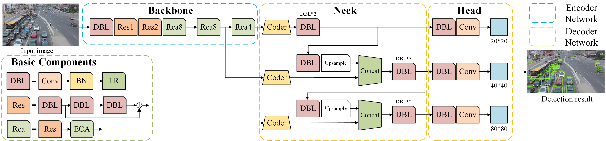

# YOLO-CCA: An Encoder-Decoder Framework Vehicle Detector Based on Channel Attention
Official PyTorch implementation of our paper 
* **Title**: [YOLO-CCA: An Encoder-Decoder Framework Vehicle Detector Based on Channel Attention](https://ieeexplore.ieee.org/abstract/document/10235599)
* **Authors**: Xuyang Liu, Linyun Liu, and Tianle Liu
* **Institutes**: Hebei University of Technology and Northwestern Polytechnical University  

## Overview

  

In this work, we introduce a novel vehicle detection algorithm called YOLO-CCA inspired by channel attention technique. Efficient Channel Attention (ECA) and Encoder-Decoder modules are adopted into YOLO-CCA algorithm for vehicle detection. With the introduction of the Complete-IoU (CIoU) loss function, the convergence rate is also accelerated. YOLO-CCA algorithm is capable of capturing cross-channel information and maximizing it, which leads to high accuracy for vehicle detection, especially for small vehicle targets detection.
